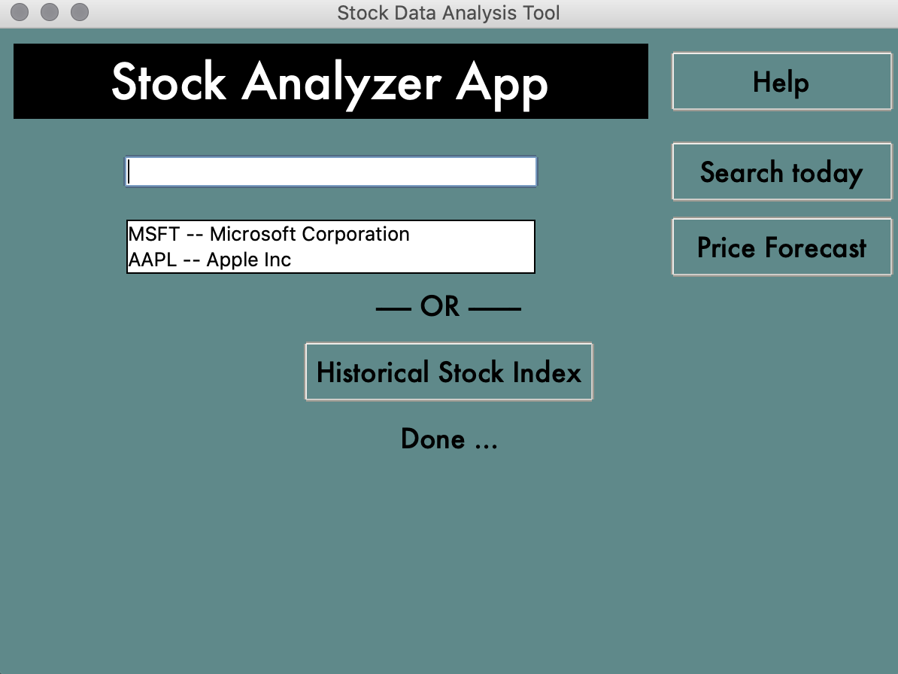

# CIS41B_FINAL_README


# Requirements
You will need mpl_finance, pandas, numpy, matplotlib, sqlite3, and sklearn.
If any of these are not installed on your system you can pip install them like the 
examples below
```bash
$ python3 -m pip install mpl_finance
$ python3 -m pip install pandas
$ python3 -m pip install sklearn
```


# Source Files:

| File                          | Short Description                       |
| ------------------------------|:---------------------------------------:| 
| front_end.py                  | Front end with GUI                      | 
| back_end.py                   | Backend with Database/Server interface  |   
| interactive_candlestick_v3.py | - Power user graph                      |    
| interactive_plot_v3.py        | - Simple user graph                     |    
| iregression.py                | - Regression with price prediction      |    


# Summary:
This app allows user to search stock, show concise current price details or show detailed price graph with custom analyses including moving average and regression analysis

The following extra modules need to be installed as discussed with professor beforehand:
sklearn, mpl_finance, pandas

Upon initial construction, 10 threads will be spawned to simultaneously download streams of SNP top 10 stock prices for the past 5 years as well as current prices and store in a database.

For the class project purpose, download and search will be limited to these top 10 SNP stocks. However, number of stocks can easily be increased for future expansion.


# Demo:


# App Layout



## Front-end Buttons
Help Button    
> Shows README.md, app summary, and useful links 
---
Entry box                     
> User can type in the SNP top 10 symbols to search pricing  
---
Search today 
> User can either press enter in the entry box, or press search button to show the detailed pricing window 
---
List box        
> As user types in the entry box, listbox shows the valid stock symbol that can be fetched       
---
Price Forecast               
> Shows regression graph with price prediction based on 5 year data                    
---
Historical Stock Index Button 
> Allows user to select from top 10 SNP, time range to analyze, and whether to show simple or complex graph. 
---


